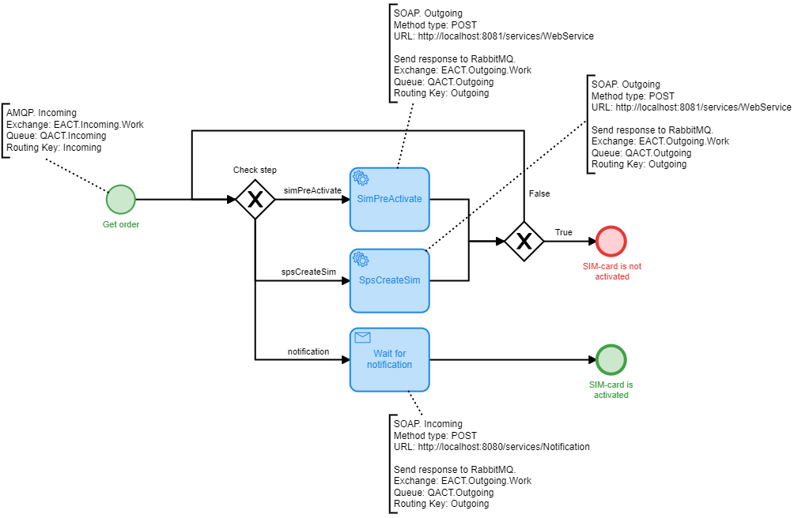

# SIM-card activator
This example shows:
* How to set up Camunda in Spring Boot application.
* How to use AMQP and SOAP in your processes the Spring way.

## Business process

* It is triggered via SOAP.
* Calls a SOAP service.
* Sends an AMQP message as a response.

## Preconditions
### RabbitMQ
1. Install RabbitMQ.
2. Upload this [configuration](https://github.com/endryu1994/SimCardActivator/blob/Readme/src/test/resources/rabbitmq/rabbitmq_config.json) using "Import definitions" in RabbitMQ UI.

### SoapUI
1. Install SoapUI.
2. Import [projects](https://github.com/endryu1994/SimCardActivator/tree/Readme/src/test/resources/soapui) to SoapUI.
3. Open WebService project and start MockService.

## Project setup
* Spring Boot v.2.4.4
* Camunda v.7.14.0
* PostgreSQL v.42.2.19. 
Also you can use embedded H2. For this you need to change [application.properties](https://github.com/endryu1994/SimCardActivator/blob/Readme/src/main/resources/application.properties) file.
Please take a look at the [pom.xml](https://github.com/endryu1994/SimCardActivator/blob/Readme/pom.xml) for details. 
Also note the [SimCardActivationApplication.java](https://github.com/endryu1994/SimCardActivator/blob/Readme/src/main/java/com/akybenko/activation/SimCardActivationApplication.java) as Spring Boot starter class.

## Get started
* Clone or download this example
* Maven build
> mvn clean install
* Run application
> java -jar target/sim-card-activation-camunda-0.0.1-SNAPSHOT.jar

## Testing
1. Publish [order](https://github.com/endryu1994/SimCardActivator/blob/Readme/src/test/resources/order/order.json) to
 QACT.Incoming queue.
2. Send a Notification SOAP message to the application from Notification project in SOAP UI.
